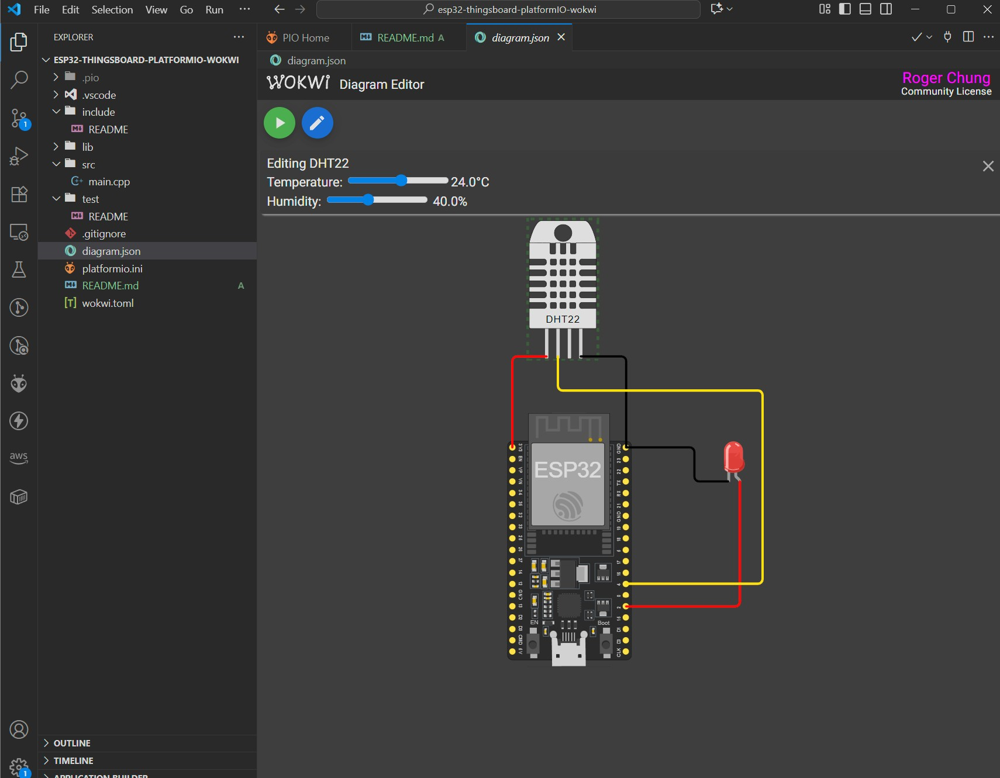

# ESP32 ThingsBoard with DHT22 Sensor and LED

This project is a **basic template** for ESP32 that integrates a DHT22 temperature/humidity sensor and a controllable LED, all simulated in **Wokwi** and connected to **ThingsBoard** for IoT.

## 📋 Description

The project implements:
- 📡 Automatic WiFi connection
- 🌡️ Temperature and humidity reading with DHT22 sensor
- 💡 Remote LED control via ThingsBoard
- 📊 Telemetry data sending every 2 seconds
- 🔄 Bidirectional state and attribute control
- 📱 Complete simulation in Wokwi

## 🔧 Hardware Used

### Physical Components
- **ESP32 DevKit C v4** - Main microcontroller
- **DHT22** - Digital temperature and humidity sensor
- **Red LED** - Controllable visual indicator

### Connections (according to diagram.json)



```
DHT22:
├── VCC → ESP32 3V3
├── GND → ESP32 GND
└── DATA → ESP32 GPIO4

LED:
├── Anode → ESP32 GPIO2
└── Cathode → ESP32 GND

```

## 📚 Dependencies and Libraries

### PlatformIO Libraries
```ini
lib_deps = 
    thingsboard/ThingsBoard@0.14.0           # ThingsBoard MQTT Client
    arduino-libraries/ArduinoHttpClient@^0.6.1  # HTTP Client
    arduino-libraries/ArduinoMqttClient@^0.1.8  # MQTT Client
    knolleary/PubSubClient@^2.8              # MQTT Pub/Sub
    adafruit/DHT sensor library@^1.4.6      # DHT22 Driver
```

### System Libraries
- `WiFi.h` - WiFi connectivity (ESP32)
- `Arduino_MQTT_Client.h` - MQTT client for ThingsBoard
- `Server_Side_RPC.h` - Remote RPC calls
- `Attribute_Request.h` - Attribute requests
- `Shared_Attribute_Update.h` - Shared attribute updates
- `DHT.h` - Temperature/humidity sensor

## ⚙️ Configuration

### 1. WiFi Credentials
```cpp
constexpr char WIFI_SSID[] = "Wokwi-GUEST";      // WiFi Network
constexpr char WIFI_PASSWORD[] = "";             // Password (empty for Wokwi)
```

### 2. ThingsBoard Configuration
```cpp
constexpr char TOKEN[] = "xxxxxxxxxxxxxxxxxxxx";           // Device token (from thingboard)
constexpr char THINGSBOARD_SERVER[] = "thingsboard.cloud"; // ThingsBoard server
constexpr uint16_t THINGSBOARD_PORT = 1883U;               // MQTT port
```

### 3. Hardware Pins
```cpp
#define DHTPIN 4        // DHT22 sensor pin
#define DHTTYPE DHT22   // DHT sensor type
#define LED_PIN 2       // External LED pin
```

## 🚀 Installation and Usage

### 1. Prerequisites
- [PlatformIO IDE](https://platformio.org/platformio-ide) or [PlatformIO Core](https://platformio.org/install/cli)
- Account on [ThingsBoard Cloud](https://thingsboard.cloud/) or local server
- Access to [Wokwi](https://wokwi.com/) for simulation

### 2. Project Setup
```bash
# Clone the repository
git clone <repository-url>
cd esp32-thingsboard-platformio-wokwi

# Install dependencies
pio lib install

# Build the project
pio run
```

### 3. ThingsBoard Configuration
1. Create a new device in ThingsBoard
2. Copy the device **Access Token**
3. Replace the `TOKEN` in `main.cpp`
4. Configure dashboard to visualize:
   - `temperature` (°C)
   - `humidity` (%)
   - `ledState` (boolean)
   - `ledMode` (0=manual, 1=automatic)

### 4. Wokwi Simulation
1. Open the project in Wokwi
2. The `diagram.json` file contains hardware configuration
3. Run the simulation
4. Monitor serial port for debugging

## 📊 Features

### Automatic Telemetry (every 2s)
- **temperature**: Temperature in °C from DHT22
- **humidity**: Relative humidity in % from DHT22
- **ledState**: Current LED state (true/false)
- **ledMode**: LED mode (0=manual, 1=blinking)

### Device Attributes
- **macAddress**: ESP32 MAC address
- **rssi**: WiFi signal strength
- **channel**: WiFi channel
- **bssid**: Access Point BSSID
- **localIp**: Assigned local IP
- **ssid**: WiFi network name

### Remote Control (RPC)
- **setLedMode**: Change LED mode
  ```json
  {"method": "setLedMode", "params": 0}  // Manual mode
  {"method": "setLedMode", "params": 1}  // Blinking mode
  ```

### Shared Attributes
- **ledState**: Control LED state (true/false)
- **blinkingInterval**: Blinking interval in ms (10-60000)

## 🏗️ Project Structure

```
esp32-thingsboard-platformio-wokwi/
├── src/
│   └── main.cpp             # Main code
├── include/
│   └── README               # Custom headers
├── lib/
│   └── README               # Local libraries
├── test/
│   └── README               # Unit tests
├── platformio.ini           # PlatformIO configuration
├── wokwi.toml               # Wokwi configuration
├── diagram.json             # Wokwi circuit diagram
└── README.md                
```

## 🔍 Monitoring and Debug

### Serial Monitor
```bash
pio device monitor --baud 115200
```

### Main Debug Messages
- WiFi connection: `"Connected to AP"`
- ThingsBoard connection: `"Subscribe done"`
- DHT22 readings: `"Failed to read from DHT sensor!"` (if error)
- RPC received: `"Received the set led state RPC method"`
- Attribute changes: `"LED state is set to: X"`

## 🎛️ Customization

### Change Telemetry Interval
```cpp
constexpr int16_t telemetrySendInterval = 2000U;  // Change value in ms
```

## 🐛 Troubleshooting

### Common Issues

1. **WiFi connection fails**
   - Verify SSID and password
   - In Wokwi use "Wokwi-GUEST" without password

2. **ThingsBoard connection fails**
   - Verify device token
   - Check network connectivity
   - Review firewall on port 1883

3. **DHT22 sensor not responding**
   - Verify connections in `diagram.json`
   - Check DATA pin (GPIO4)
   - Add longer delay in initialization

4. **LED not responding**
   - Verify LED_PIN (GPIO2)
   - Check anode/cathode connection
   - Review control logic in ThingsBoard

## 📄 License

This project is an open source educational template. Free to use and modify.

## 🤝 Contributions

Contributions are welcome! Please:
1. Fork the project
2. Create a branch for your feature
3. Commit your changes
4. Open a Pull Request

## 📞 Support

For questions or issues:
- Create an issue in the repository
- Review [ThingsBoard documentation](https://thingsboard.io/docs/devices-library/esp32-dev-kit-v1/)
- Check [Wokwi documentation](https://docs.wokwi.com/)

---
**Author**: Mirutec - Roger Chung  
**Version**: 1.0  
**Date**: September 2025
